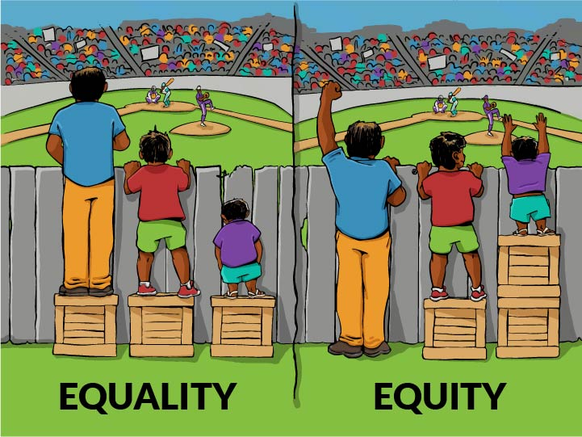

Diversity, equity, and inclusion (DEI) are organisational frameworks which seek to promote the fair treatment and full participation of all people, particularly groups who have historically been underrepresented or subject to discrimination on the basis of identity or disability.

<plantuml data-caption="caption" data-alt="alt text">
@startmindmap

* DEI
  * Diversity
  * Equity
  * Inclusion

@endmindmap
</plantuml>

_Note: The information on this page is mainly summarised from the references listed below._

## Diversity, Equity, Inclusion

* **Diversity**: Representation of people from a variety of backgrounds at all levels in an organisation.
  * Includes race, gender, ethnicity, sexual orientation, disability, age, culture, class, religion, or opinion.
  * Richard Thaler: "We tend to think about [diversity] in terms of things like racial diversity and gender diversity and ethnic diversity. Those things are all important. But it's also important to have diversity in how people think." (Javetski & Koller, 2018)
* **Equity**: Fair treatment for all people, so that the norms, practices, and policies in place ensure identity is not predictive of opportunities or workplace outcomes.
  * _Equality_ assumes that all people should be treated the same.
  * _Equity_ takes into consideration a person's unique circumstances, adjusting treatment accordingly so that the **end result** is equal.
  * Bill Schaninger: "There's a real difference between equal and equitable. Suppose we said, 'All interns are created equal. We pay them nothing.' The people who can afford an entire summer without getting paid are likely already coming from a position of privilege." (_What Is Diversity, Equity, and Inclusion?_, 2022)

* **Inclusion**: How the workforce experiences the workplace and the degree to which organisations embrace all employees and enable them to make meaningful contributions.
  * Whether people feel like they belong, and whether they feel heard or valued in an organisation.
  * Diana Ellsworth: "The LGBTQ+ community is underrepresented in the workplace, especially at more senior levels. As a result, many feel like an "only" at work and are more likely to experience microaggressions; they might feel unable to talk openly and comfortably about themselves, for example, or need constantly to correct assumptions about their personal lives." (_What Is Diversity, Equity, and Inclusion?_, 2022)
  * "Onlyness": Being the only one on a team or in a meeting with their given gender identity, sexual orientation, or race.

## References

* Wikipedia contributors. (2024, August 19). _Diversity, equity, and inclusion_. Wikipedia. <https://en.wikipedia.org/wiki/Diversity,_equity,_and_inclusion>
* Alfonseca, K. (2023, February 10). _DEI: What does it mean and what is its purpose?_ ABC News; ABC News. <https://abcnews.go.com/US/dei-programs/story?id=97004455>
* Javetski, B., & Koller, T. (2018, May 9). _Debiasing the corporation: An interview with Nobel laureate Richard Thaler_. McKinsey & Company; McKinsey & Company. <https://www.mckinsey.com/capabilities/strategy-and-corporate-finance/our-insights/debiasing-the-corporation-an-interview-with-nobel-laureate-richard-thaler>
* _What is diversity, equity, and inclusion?_ (2022, July 15). McKinsey & Company; McKinsey & Company. <https://www.mckinsey.com/featured-insights/mckinsey-explainers/what-is-diversity-equity-and-inclusion>
